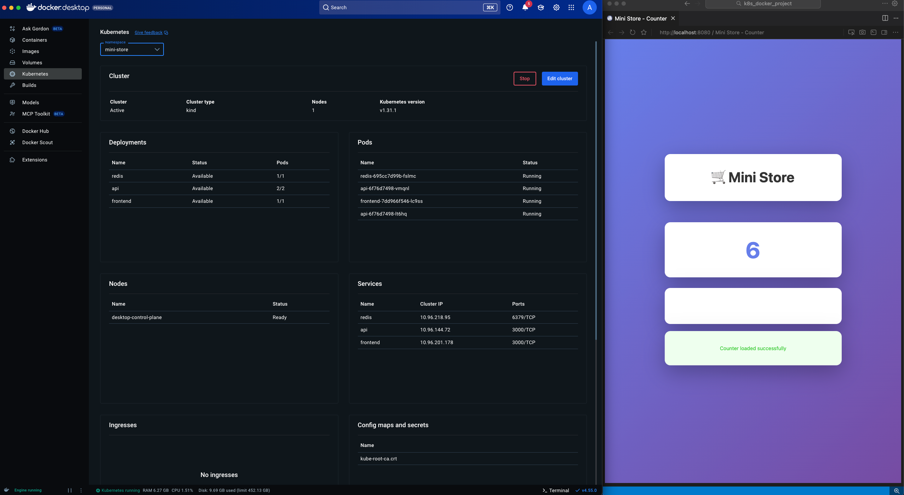

# k8s-mini-store

A simple learning project to learn how Kubernetes + Docker using a simple counter application with a frontend, API, and Redis backend.



## Challenges This Solution Solves

This project demonstrates how Kubernetes and Docker address common challenges in modern application development and deployment:

### 🚀 **Application Scalability**
- **Challenge**: Applications need to handle varying loads. A single server can become a bottleneck.
- **Solution**: Kubernetes allows you to scale applications horizontally by running multiple replicas of your services. The API in this project runs 2 replicas, and you can scale up or down based on demand.

### 🔄 **High Availability & Reliability**
- **Challenge**: Single points of failure can bring down entire applications.
- **Solution**: Kubernetes automatically restarts failed containers, distributes traffic across healthy pods, and ensures your application stays available even if individual components fail.

### 🏗️ **Microservices Architecture**
- **Challenge**: Monolithic applications are hard to maintain, scale, and deploy independently.
- **Solution**: This project demonstrates a microservices architecture where frontend, API, and database are separate services that can be developed, deployed, and scaled independently.

### 📦 **Containerization & Portability**
- **Challenge**: "It works on my machine" - applications behave differently across environments.
- **Solution**: Docker containers package applications with all dependencies, ensuring consistent behavior across development, staging, and production environments.

### 🔍 **Service Discovery & Networking**
- **Challenge**: Services need to find and communicate with each other reliably in a distributed system.
- **Solution**: Kubernetes provides built-in service discovery. Services can find each other by name (e.g., `api:3000`, `redis:6379`) without hardcoding IP addresses.

### ⚡ **Resource Management**
- **Challenge**: Applications can consume excessive resources, affecting other services on the same infrastructure.
- **Solution**: Kubernetes allows you to set CPU and memory limits per container, ensuring fair resource allocation and preventing resource exhaustion.

### 🔄 **Zero-Downtime Deployments**
- **Challenge**: Deploying updates requires taking applications offline, causing service interruptions.
- **Solution**: Kubernetes supports rolling updates, allowing you to deploy new versions gradually while keeping the application available.

## How This Project Demo Works

This project demonstrates a complete containerized microservices application:

1. **Frontend Service (Next.js)**
   - Serves a React-based web interface
   - Users can view and increment a counter
   - Uses Next.js API routes to proxy requests to the backend API
   - Runs in a container, accessible via NodePort service

2. **API Service (Node.js/Express)**
   - Handles business logic for the counter
   - Exposes REST endpoints: `/healthz`, `/count`, `/inc`
   - Connects to Redis for data persistence
   - Runs 2 replicas for high availability
   - Includes health checks for automatic recovery

3. **Redis Service**
   - Stores the counter value in memory
   - Provides fast data access
   - Demonstrates stateful service deployment

4. **Kubernetes Orchestration**
   - Manages all services in a dedicated namespace
   - Handles service discovery and networking
   - Monitors health and restarts failed containers
   - Manages resource allocation and limits

**User Flow:**
1. User opens the frontend in a browser
2. Frontend displays the current counter value (fetched from API)
3. User clicks "Increment Counter" button
4. Frontend sends POST request to Next.js API route
5. Next.js API route proxies to backend API service
6. Backend API increments counter in Redis
7. Updated count is returned and displayed to the user

## Who Benefits From This Solution?

### 👨‍💻 **Software Developers**
- Learn containerization and microservices patterns
- Understand how to structure applications for Kubernetes
- Gain hands-on experience with modern deployment practices
- See how services communicate in a distributed system

### 👨‍💼 **DevOps Engineers**
- Practice Kubernetes deployment and configuration
- Learn service discovery, networking, and resource management
- Understand health checks, probes, and auto-recovery
- Gain experience with container orchestration

### 🎓 **Students & Learners**
- Beginner-friendly introduction to Kubernetes concepts
- Hands-on project to understand containerization
- Learn industry-standard tools and practices
- Build a portfolio project demonstrating cloud-native skills

### 🏢 **Startups & Small Teams**
- Understand how to structure applications for scalability
- Learn cost-effective deployment strategies
- See how to build resilient, production-ready applications
- Foundation for moving to cloud platforms (AWS EKS, GKE, AKS)

### 🏗️ **Architects & Technical Leads**
- Reference implementation for microservices architecture
- Example of best practices for Kubernetes deployments
- Demonstrates separation of concerns and service boundaries
- Template for building similar applications

### 🔄 **Teams Migrating to Cloud-Native**
- Understand containerization benefits
- Learn Kubernetes fundamentals before cloud migration
- Practice local development with production-like environments
- Build confidence with orchestration tools

## Architecture

- **Frontend**: Next.js React application with API route proxies
- **API**: Node.js/Express service that manages a counter in Redis
- **Redis**: In-memory data store for the counter value

### Request Flow

1. **Browser** → Next.js Frontend (port 3000)
2. **Next.js API Routes** (`/api/count`, `/api/inc`) → Backend API Service (`http://api:3000`)
3. **Backend API** → Redis Service (`redis:6379`)

## Prerequisites

Before starting, ensure you have the following installed:

- **Docker Desktop** (version 20.10+) with Kubernetes enabled
- **kubectl** (Kubernetes CLI)

### Installation Quick Reference

**macOS (using Homebrew):**
```bash
brew install --cask docker
brew install kubectl
```

**Windows:**
- Download and install Docker Desktop from [docker.com](https://www.docker.com/products/docker-desktop)
- kubectl is included with Docker Desktop

**Linux:**
```bash
# Docker Desktop (if available) or Docker Engine
curl -fsSL https://get.docker.com -o get-docker.sh
sh get-docker.sh

# kubectl
curl -LO "https://dl.k8s.io/release/$(curl -L -s https://dl.k8s.io/release/stable.txt)/bin/linux/amd64/kubectl"
sudo install -o root -g root -m 0755 kubectl /usr/local/bin/kubectl
```

### Enable Kubernetes in Docker Desktop

1. Open **Docker Desktop**
2. Go to **Settings** (gear icon)
3. Navigate to **Kubernetes** in the left sidebar
4. Check **Enable Kubernetes**
5. Click **Apply & Restart**
6. Wait for Kubernetes to start (you'll see a green indicator when ready)

## Quick Start

> **Note**: This project uses Docker Desktop's built-in Kubernetes. If you previously used `kind`, you'll need to:
> 1. Delete your kind cluster: `kind delete cluster --name mini-store` (if it exists)
> 2. Enable Kubernetes in Docker Desktop (see Prerequisites)
> 3. Follow the steps below

### Step 1: Verify Docker Desktop Kubernetes is Running

Ensure Kubernetes is enabled and running in Docker Desktop (see Prerequisites above).

Verify the cluster is running:
```bash
kubectl cluster-info
kubectl get nodes
```

You should see output showing your Docker Desktop Kubernetes cluster. The context should be `docker-desktop` or `docker-for-desktop`.

### Step 2: Build Docker Images

Build the API image:
```bash
docker build -t mini-api:1 ./api
```

Build the frontend image:
```bash
docker build -t mini-frontend:1 ./frontend
```

**Note**: The frontend uses a multi-stage Docker build for optimized production images. The build process:
1. Installs dependencies
2. Builds the Next.js application
3. Creates a minimal production image with only necessary files

### Step 3: Verify Images are Available

Docker Desktop Kubernetes can access your local Docker images directly. Verify your images exist:

```bash
docker images | grep mini
```

You should see:
- `mini-api:1`
- `mini-frontend:1`

**Note**: 
- Docker Desktop Kubernetes uses the same Docker daemon, so local images are automatically available
- The manifests use `imagePullPolicy: IfNotPresent` to use local images when available
- Redis image (`redis:7-alpine`) will be pulled automatically from Docker Hub when you deploy

### Step 4: Deploy to Kubernetes

Apply all Kubernetes manifests. **Important**: Apply the namespace first to avoid race conditions:
```bash
# Apply namespace first
kubectl apply -f k8s/namespace.yaml

# Wait a moment for namespace to be ready, then apply all resources
sleep 2
kubectl apply -f k8s/
```

Or apply everything at once (Kubernetes will handle dependencies):
```bash
kubectl apply -f k8s/
```

This creates:
- A namespace called `mini-store`
- Redis deployment and service
- API deployment (2 replicas) and service
- Frontend deployment and NodePort service

### Step 5: Verify Deployment

Check that all pods are running:
```bash
kubectl get pods -n mini-store
```

You should see output like:
```
NAME                        READY   STATUS    RESTARTS   AGE
api-xxxxxxxxxx-xxxxx         1/1     Running   0          30s
api-xxxxxxxxxx-xxxxx         1/1     Running   0          30s
frontend-xxxxxxxxxx-xxxxx    1/1     Running   0          30s
redis-xxxxxxxxxx-xxxxx       1/1     Running   0          30s
```

Wait until all pods show `READY 1/1` and `STATUS Running`.

### Step 6: Access the Application

#### Find the NodePort

Get the NodePort assigned to the frontend service:
```bash
kubectl get svc frontend -n mini-store
```

Look for the port mapping like `3000:3XXXX/TCP` where `3XXXX` is your NodePort.

#### Access via Browser

Since Docker Desktop Kubernetes runs locally, you can use port-forward or access via NodePort:

**Option 1: Port Forward (Recommended)**
```bash
kubectl port-forward svc/frontend 8080:3000 -n mini-store
```

Then open http://localhost:8080 in your browser.

**Option 2: Direct NodePort (alternative)**
```bash
# Get the NodePort number
kubectl get svc frontend -n mini-store

# Access via: http://localhost:<NodePort>
# Note: NodePort services are accessible on localhost with Docker Desktop Kubernetes
```

#### Test API Endpoints Directly

Port-forward the API service:
```bash
kubectl port-forward svc/api 3000:3000 -n mini-store
```

Then test in another terminal:
```bash
# Health check
curl http://localhost:3000/healthz

# Get count
curl http://localhost:3000/count

# Increment count
curl -X POST http://localhost:3000/inc
```

## Project Structure

```
k8s-mini-store/
├── api/
│   ├── package.json      # Node.js dependencies (express, redis)
│   ├── index.js          # Entry point
│   ├── src/
│   │   └── server.js     # Express API server
│   ├── Dockerfile        # API container image
│   └── .dockerignore     # Docker ignore patterns
├── frontend/
│   ├── package.json      # Next.js dependencies
│   ├── next.config.js    # Next.js configuration
│   ├── public/           # Static assets directory (required by Next.js)
│   ├── pages/
│   │   ├── _app.js       # Next.js app wrapper
│   │   ├── index.js      # Main React page
│   │   └── api/
│   │       ├── count.js  # API route proxy for /count
│   │       └── inc.js    # API route proxy for /inc
│   ├── Dockerfile        # Next.js production image (multi-stage build)
│   └── .dockerignore     # Docker ignore patterns
├── k8s/
│   ├── namespace.yaml    # Kubernetes namespace
│   ├── redis.yaml        # Redis deployment & service
│   ├── api.yaml          # API deployment & service
│   └── frontend.yaml     # Frontend deployment & service
└── README.md             # This file
```

## API Endpoints

### Backend API (Node.js/Express)

- `GET /healthz` - Health check endpoint (returns `{status: "ok"}`)
- `GET /count` - Get current counter value (returns `{count: <number>}`)
- `POST /inc` - Increment counter (returns `{count: <number>}`)

### Frontend API Routes (Next.js)

The frontend exposes Next.js API routes that proxy to the backend:
- `GET /api/count` - Proxies to backend `/count`
- `POST /api/inc` - Proxies to backend `/inc`

These routes are accessible from the browser and handle the communication with the backend API service.

## Troubleshooting

### Pods Not Starting

**Check pod status:**
```bash
kubectl get pods -n mini-store
kubectl describe pod <pod-name> -n mini-store
kubectl logs <pod-name> -n mini-store
```

**Common issues:**
- **ImagePullBackOff / ErrImageNeverPull**: Image not found. Ensure you've built the images locally (`docker images | grep mini`). Docker Desktop Kubernetes uses `imagePullPolicy: IfNotPresent` to access local images.
- **CrashLoopBackOff**: Check logs for errors. Common causes: missing env vars, Redis connection issues.
- **Pending**: Check if nodes have resources. Run `kubectl describe node`. Ensure Docker Desktop has enough resources allocated.
- **Namespace not found errors**: If you see namespace errors when applying, apply the namespace first: `kubectl apply -f k8s/namespace.yaml && sleep 2 && kubectl apply -f k8s/`

### API Can't Connect to Redis

**Check Redis is running:**
```bash
kubectl get pods -n mini-store | grep redis
kubectl logs <redis-pod-name> -n mini-store
```

**Test Redis connection from API pod:**
```bash
kubectl exec -it <api-pod-name> -n mini-store -- sh
# Inside pod, test Redis connection
```

### Frontend Can't Reach API

**Check API service:**
```bash
kubectl get svc api -n mini-store
kubectl get endpoints api -n mini-store
```

**Test from frontend pod:**
```bash
kubectl exec -it <frontend-pod-name> -n mini-store -- sh
# Inside pod
wget -O- http://api:3000/healthz
# Or test Next.js API routes
wget -O- http://localhost:3000/api/count
```

### Port Forward Not Working

- Ensure the service is running: `kubectl get svc -n mini-store`
- Check if port is already in use: `lsof -i :8080` (macOS/Linux) or `netstat -ano | findstr :8080` (Windows)
- Try a different port: `kubectl port-forward svc/frontend 8081:3000 -n mini-store`
- If port-forward keeps disconnecting, run it in the background or use a tool like `kubectl port-forward` with `--address 0.0.0.0` for network access

### Docker Build Issues

**Frontend build fails with "public directory not found":**
- The `public/` directory is required by Next.js (even if empty)
- It should already exist in the project, but if missing, create it: `mkdir -p frontend/public`

**Images not found (ImagePullBackOff):**
- Verify images exist: `docker images | grep mini`
- Rebuild if needed: `docker build -t mini-api:1 ./api && docker build -t mini-frontend:1 ./frontend`
- Ensure `imagePullPolicy: Never` is set in the manifests (already configured)
- Docker Desktop Kubernetes uses the same Docker daemon, so local images are automatically available

### Clean Up and Start Fresh

Delete everything and start over:
```bash
kubectl delete namespace mini-store
# Rebuild images if needed
docker build -t mini-api:1 ./api
docker build -t mini-frontend:1 ./frontend
# Redeploy
kubectl apply -f k8s/
```

## Viewing Your Cluster

### In Docker Desktop Kubernetes Module

1. Open **Docker Desktop**
2. Go to the **Containers** tab - you'll see all your pods running as containers
3. Click on any pod container to:
   - View logs in real-time
   - Execute commands (terminal access)
   - Inspect container details
   - View resource usage
4. Go to the **Images** tab to see all container images
5. The Kubernetes module provides a visual interface for your cluster resources

**Note**: With Docker Desktop Kubernetes, each pod appears as a separate container, making it easy to monitor and manage your applications.

### Using kubectl

```bash
# View all resources
kubectl get all -n mini-store

# View pods with details
kubectl get pods -n mini-store -o wide

# View services
kubectl get svc -n mini-store

# View deployments
kubectl get deployments -n mini-store

# Describe a specific resource
kubectl describe pod <pod-name> -n mini-store
```

## Cleanup

To remove the entire setup:

```bash
# Delete Kubernetes resources
kubectl delete namespace mini-store

# Optional: Remove Docker images
docker rmi mini-api:1 mini-frontend:1

# Note: Docker Desktop Kubernetes will continue running unless you disable it in Docker Desktop settings
```

## Learning Points

This project demonstrates:

1. **Containerization**: Docker images for each component
2. **Kubernetes Deployments**: Managing application replicas
3. **Services**: Internal networking between pods
4. **Namespaces**: Organizing resources
5. **Health Probes**: Liveness and readiness checks
6. **Resource Management**: CPU and memory limits
7. **Next.js API Routes**: Server-side API proxies
8. **Service Discovery**: Pods finding each other via service names
9. **React Frontend**: Modern React-based UI with Next.js

